对最新的 mermaid 文档进行翻译。复杂的流程图代码是看完整个文档，根据它的图片自己写的对应的 mermaid 代码（官方文档未提供）。有些功能需要特定版本的 mermaid 支持，如状态图必须是 v8.4 版本的。官方文档对甘特图的说明写的很简略，而且在样式类章节中出现不是该类图的属性，故删除。

# mermaid
[TOC]

## 开始
### mermaid
#### 8.4 版本中新的图表
在 8.4 版本中，类图有了一些新的特性、bug修复和文档。8.4 版本中的另一个新特性是新的图类型，即状态图。

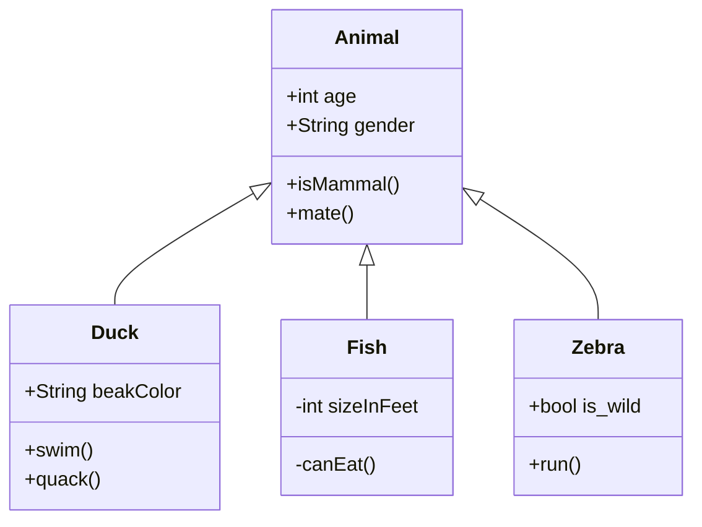

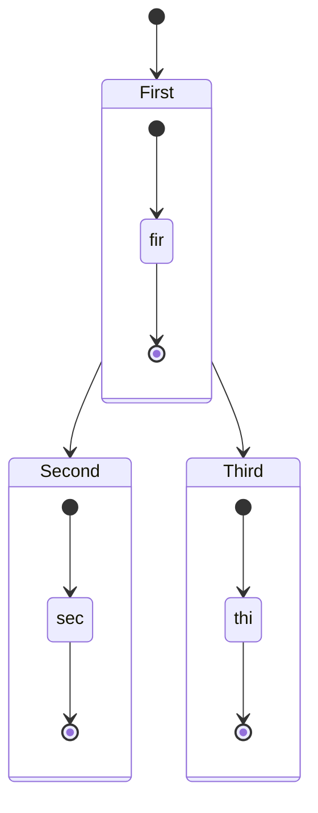

#### 关于 8.2 版本的特别说明
在 8.2 版本中引入了安全性改进。引入了一个 securityLevel 配置，它设置了要在解析图上使用的信任级别。

- true: (默认)对文本标签进行编码，禁用单击功能
- false: 允许使用文本标签，启用单击功能

已解决的问题：

**请注意**：这将改变 mermaid 的默认行为，以便升级到 8.2 之后，如果未配置 securityLevel，~~则流程图中的标记将被编码为标记~~，并且禁止单击。

如果您的应用程序对图源安全性负责，您可以相应地设置 securityLevel。通过这样做，将再次允许单击和标记。

```js
mermaidAPI.initialize({
    securityLevel: 'loose'
});
```

保持稳定的脉搏（保持稳定的更新）：mermaid 需要更多的合作者。


以类似于 markdown 的方式从文本生成图表和流程图。

在解释代码时，是否曾经想过简化文档并避免使用 Visio 之类的笨重工具？

这就是 mermaid 诞生的原因，这是一种简单的类似于 markdown 的脚本语言，用于通过 javascript 从文本生成图表。

**Mermaid 被提名并赢得"最令人兴奋的技术使用"类别的 JS 开源奖(2019)。感谢所有参与的人，提交拉请求的人，回答问题的人，特别感谢帮助我维护这个项目的Tyler Long。**

#### 流程图

```md
graph TD;
    A-->B;
    A-->C;
    B-->D;
    C-->D;
```


#### 顺序图（时序图）

```md
sequenceDiagram
    participant Alice
    participant Bob
    Alice->>John: Hello John, how are you?
    loop Healthcheck
        John->>John: Fight against hypochondria
    end
    Note right of John: Rational thoughts <br/>prevail!
    John-->>Alice: Great!
    John->>Bob: How are you?
    Bob-->>John: Jolly good!
```


#### 甘特图

```md
gantt
    dateFormat YYYY-MM-DD
    title Adding GANTT diagram to mermaid
    excludes weekdays 2014-01-10
    
    section A section
    completed task      :done, des1, 2014-01-06,2014-01-08
    Active task     :active, des2, 2014-01-09, 3d
    Future task     :   des3, after des2, 5d
    Future task2    :   des4, after des3, 5d
```

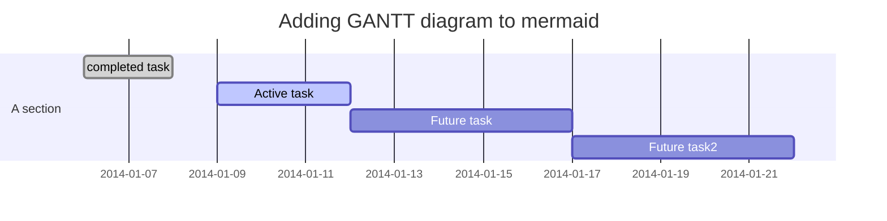

**MWeb 不支持甘特图中的 excludes 语句。**

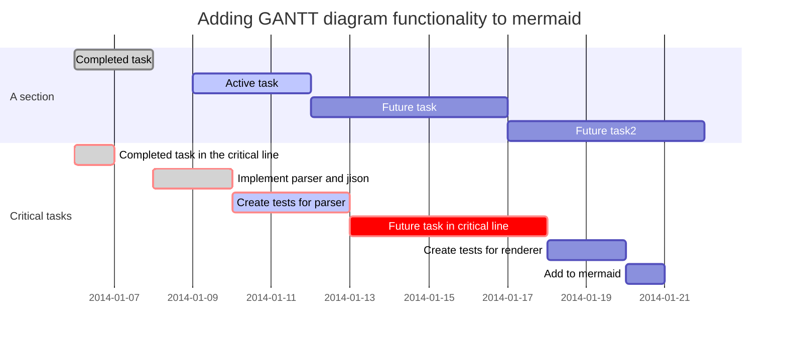

#### 类图：实验性

```md
classDiagram
    Class01 <|-- AveryLongClass : Cool
    Class03 *-- Class04
    Class05 o-- Class06
    Class07 .. Class08
    Class09 --> C2 : Where am i?
    Class09 --* C3
    Class09 --|> Class07
    Class07 : equals()
    Class07 : Object[] elementData
    Class01 : size()
    Class01 : int chimp
    Class01 : int gorilla
    Class08 <--> C2: Cool label
```

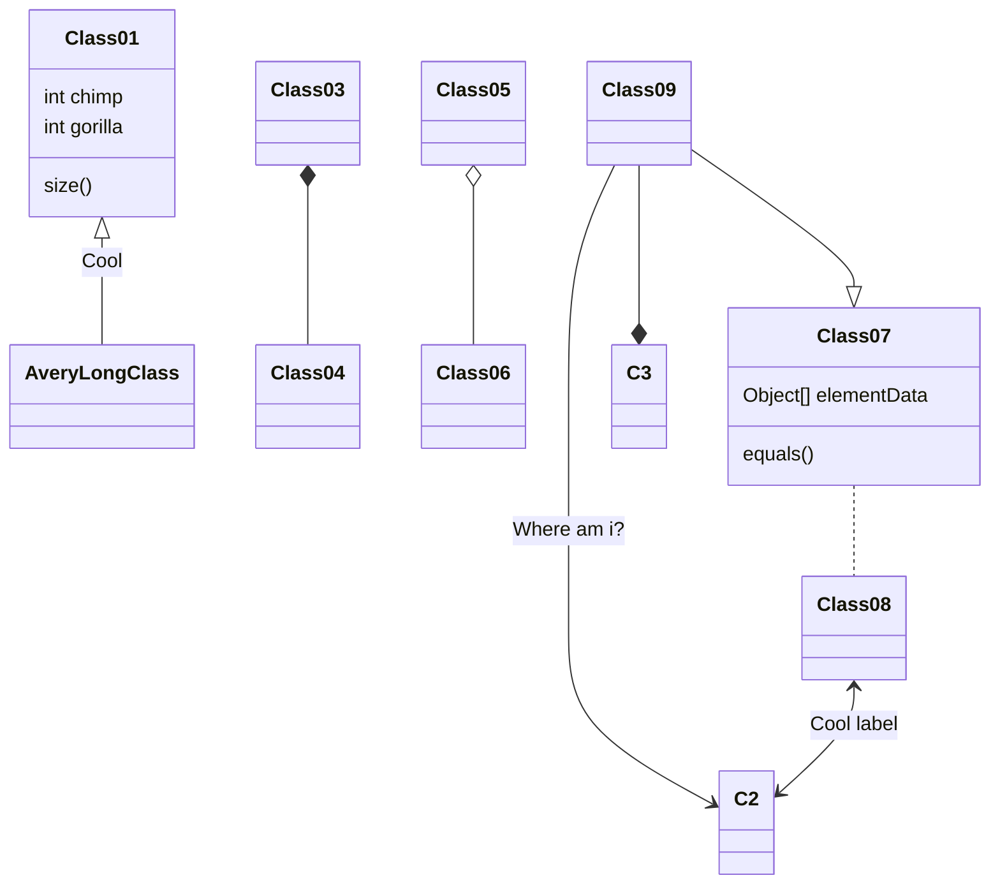

#### Git 图：实验性

```md
gitGraph:
options
{
    "nodeSpacing": 150,
    "nodeRadius": 10
}
end
commit
branch newbranch
checkout newbranch
commit
commit
checkout master
commit
commit
merge newbranch
```


#### 安装
##### CDN(Content Delivery Network)内容分发网络

```http
https://unpkg.com/mermaid@<version>/dist/
```

将 `<version>` 替换为期望的版本号
示例：<https://unpkg.com/mermaid@7.1.0/dist/>

##### Node.js

```bash
yarn add mermaid
```

#### 文档

https://mermaidjs.github.io

#### 相关项目

- [mermaid CLI](https://github.com/mermaidjs/mermaid.cli)
- [mermaid live editor](https://github.com/mermaidjs/mermaid-live-editor)
- [mermaid webpack demo](https://github.com/mermaidjs/mermaid-webpack-demo)
- [mermaid Parcel demo](https://github.com/mermaidjs/mermaid-parcel-demo)

#### 寻求协助

事情越来越多，我很难保持更新。为了弥补这一点，如果我们能组成一个核心的开发团队，与 mermaid 的未来发展合作，那将是极棒的。

作为这个团队的一部分，您将获得对仓库的写入权限，并在回答问题时代表项目。

我们一起可以继续进行以下工作：

- 添加更多类型的图表，如思维导图、ert 图表等。
- 改进现有图表。

如果您想参与其中，请随时联系我。

#### 给贡献人员

##### 安装

```bash
yarn install
```

##### 构建

```bash
yarn build:watch
```

##### Lint

```bash
yarn lint
```

我们使用[eslint](https://eslint.org/)。我们建议您安装[编辑器插件](https://eslint.org/docs/user-guide/integrations)，以便获得实时的lint结果。

> ESLint 是一个插件化并且可配置的JavaScript 语法规则和代码风格的检查工具。

##### 测试

```bash
yarn test
```

在浏览器中进行手动测试：

```bash
open dist/index.html
```

##### 发行

对于那些有权限这样做的人：

更新 `package.json` 中的版本号：

```bash
npm publish
```

上面的命令将文件生成到 `dist` 文件夹中，并将其发布到 npmjs.org。

#### 鸣谢

非常感谢 [d3](http://d3js.org/) 和 [dagre-d3](https://github.com/cpettitt/dagre-d3) 项目提供了图形布局和绘图库！

还要感谢 [js-sequence-diagram](http://bramp.github.io/js-sequence-diagrams) 项目提供了用于序列图的语法用法。感谢 Jessica Peter 的灵感和甘特渲染的出发点。

*Mermaid 是由 Knut Sveidqvist 创建的，用于简化文档。*

*自2017年4月起，[Tyler Long](https://github.com/tylerlong) 成为合作伙伴。*

这是项目[贡献者](https://github.com/knsv/mermaid/graphs/contributors)的完整列表。

### FAQ(Frequently Asked Questions)常见问题

1. [如何在流程图中添加标题？](https://github.com/knsv/mermaid/issues/556#issuecomment-363182217)
2. [如何指定自定义的 CSS 文件？](https://github.com/mermaidjs/mermaid.cli/pull/24#issuecomment-373402785)
3. [如何修复工具提示的错位问题？](https://github.com/knsv/mermaid/issues/542#issuecomment-3343564621)
4. [如何指定甘特图的 xAxis 格式？](https://github.com/knsv/mermaid/issues/269#issuecomment-373229136)
5. [如何绑定事件？](https://github.com/knsv/mermaid/issues/372)
6. [如何在文本中添加换行？](https://github.com/knsv/mermaid/issues/384#issuecomment-281339381)
7. [链接文本如何包含特殊字符？](https://github.com/knsv/mermaid/issues/407#issuecomment-329944735)
8. [如何更改流程图的曲线样式？](https://github.com/knsv/mermaid/issues/580#issuecomment-373929046)

### 使用
#### 安装
##### npm 包

```bash
yarn add mermaid
```

##### CDN

https://npkg.com/mermaid/

请注意，您可以通过右上角的下拉框切换版本。

#### 网页上的简单用法

在网页上集成 mermaid 最简单的方法需要两个元素：

1. 使用 script 标签将 mermaid 的框架包含在 html 页面中。
2. 网页上的图形定义

如果这些设置就绪，那么 mermaid 将监听页面加载事件，并在被触发时（当页面已加载后），将定位页面上的图形并将其转换为 svg 文件。

##### 在您的网页上加入 mermaid

```html
<script src="mermaid.min.js"></script>
<script>mermaid.initalize({startOnLoad:true});</script>
```

在您的页面下方，mermaid 将查找 `class="mermaid"` 的标签。mermaid 将尝试从这些标签中读取图表定义并将其替换为 svg 图表。

##### 像这样定义一个图表：

```html
<div class="mermaid">
    CHART DEFINITION GOES HERE
</div>
```

最终会像这样：

```html
<div class="mermaid" id="mermaidChart0">
    <svg>
        Chart ends up here
    </svg>
</div>
```

也会在 mermaid 标签中添加一个 id 属性。

##### 在节点中启用单击事件和标签

[在节点中启用单击事件和标签](#toc_4)

##### 简单的完整示例：

```html
<!DOCTYPE html>
<html lang="en">
<head>
    <meta charset="utf-8">
</head>
<body>
    <div class="mermaid">
    graph LR
        A --- B
        B-->C[fa:fa-ban forbidden]
        B-->D(fa:fa-spinner);
    </div>
    <script src="mermaid.min.js"></script>
    <script>mermaid.initialize({startOnLoad:true});</script>
</body>
</html>
```

##### 标签越界

如果您使用通过 CSS 加载的动态加载的字体（例如 Google 字体），mermaid 则会等待整个页面加载（dom + 资源，特别是字体文件）。

```js
$(document).load(function() {
    mermaid.initialize();
});
```

或者

```js
$(document).ready(function() {
    mermaid.initialize();
});
```

否则，极有可能导致 mermaid 渲染图的标签越界。mermaid 中的默认集成使用 window.load 事件开始渲染。

如果在您的页面主体中包含其他字体，这些可能会被用来代替 mermaid 的字体。在样式中指定字体是解决此问题的方法。

```css
div.mermaid {
    font-family: 'trebuchet ms', verdana, arial;
}
```

##### 调用 `mermaid.init`

默认情况下，当文档准备就绪时，将调用 `mermaid.init`，查找所有带 `class="mermaid"` 的元素。如果要在 mermaid 加载之后添加内容，或者需要对此行为进行更细粒度的控制，您可以用如下方法自己调用 `init` ：

- 一个配置对象
- 一些节点，例如：
    - 一个普通节点
    - 数组类的节点
    - 或 W3C 选择器来查找您的节点

例如：

```js
mermaid.init({noteMargin: 10}, ".someOtherClass");
```

或没有配置对象和 jQuery 选择器：

```js
mermaid.init(undefined, $("#someId .yetAnotherClass"));
```

> **警告**：这种类型的集成已被抛弃。相反，处理更复杂的集成的首选方法是使用 mermaidAPI。

#### 与 Webpack 结合使用

mermaid 完全支持 webpack，这是一个[工作演示](https://github.com/mermaidjs/mermaid-webpack-demo)。

#### API使用

这个 API 的主要思想是能够使用图形定义作为字符串来调用渲染函数。render 函数将渲染图形并使用生成的 svg 代码调用回调。通过这种方法，站点创建者可以从站点（也许从文本区域）获取图形定义，进行渲染，然后将图形放置在站点中的某个位置。

为此，请在您的网站上包含 mermaidAPI 而不是 mermaid.js 。下面的示例概述了如何使用它。该示例仅将生成的 svg 记录到 javascript 控制台。

```html
<script src="mermaidAPI.js"></script>

<script>
    mermaidAPI.initialize({
        startOnLoad:false
    });
    $(function(){
        // Example of using the API
        var element = document.querySelector("#graphDiv");
        
        var insertSvg = function(svgCode, bindFunctions){
            element.innerHTML = svgCode;
        };
        
        var graphDefinition = 'graph TB\na-->b';
        var graph = mermaidAPI.render('graphDiv', graphDefinition, insertSvg);
    });
</script>
```

##### 绑定事件

有时，生成的图形还定义了交互，例如工具提示和单击事件。 使用 API ​​时，必须在将图形插入 DOM 后添加这些事件。

以下示例代码摘录了 mermaid 在使用 API​​ 时的操作。该示例说明了使用 API ​​进行渲染时如何将事件绑定到 svg。

```js
var insertSvg = function(svgCode, bindFunctions) {
   element.innerHTML = svgCode;
   if(typeof callback !== 'undefined'){
        callback(id);
    }
    bindFunctions(element);
};

var id = 'theGraph';

mermaidAPI.render(id, txt, insertSvg, element);
```

1. 该图形是使用 render 调用生成的。
2. 生成后，render 函数调用提供的回调函数，在本例中称为 insertSvg。
3. 使用两个参数调用回调函数，即所生成图形的 svg 代码和一个函数。 在将事件插入 DOM 之后，该函数会将事件绑定到 svg。
4. 将 svg 代码插入 DOM 进行演示。
5. 调用绑定事件的绑定函数。

#### 标记渲染器的示例

这是用 html 中的 mermaid 图表将 markdown 文档转成 html 的渲染器。

```js
var renderer = new marked.Renderer();
renderer.code = function (code, language) {
    if(code.match(/^sequenceDiagram/)||code.match(/^graph/)){
        return '<div class="mermaid">'+code+'</div>';
    }
    else{
        return '<pre><code>'+code+'</code></pre>';
    }
};
```

coffeescript 中的另一个示例在生成的标记中也包含 mermaid 脚本标签。

```coffeescript
marked = require 'marked'

module.exports = (options) ->
    hasMermaid = false
    renderer = new marked.Renderer()
    renderer.defaultCode = renderer.code
    renderer.code = (code, language) ->
        if language is 'mermaid'
            html = ''
            if not hasMermaid
                hasMermaid = true
                html += '<script src="'+options.mermaidPath+'"></script>'
            html + '<div class="mermaid">'+code+'</div>'
        else
            @defaultCode(code, language)
            
    renderer
```

#### 高级用法
##### 错误处理

当解析器遇到无效语法时，将调用 mermaid.parseError 函数。可以覆盖此函数，以便以特定于应用程序的方式处理错误。

##### 解析文本而不渲染

还可以在渲染之前验证语法，以简化用户体验。函数 mermaid.parse(txt) 以文本字符串作为参数，如果文本在语法上是正确的，则返回true，否则返回false。当 parse 函数返回 false 时，将调用 parseError 函数。

以下源码中的代码示例说明了其工作方式：

```js
mermaid.parseError = function(err, hash){
    displayErrorInGui(err);
};

var textFieldUpdated = function(){
    var textStr = getTextFromFormField('code');

    if(mermaid.parse(textStr)){
        reRender(textStr)
    }
};

bindEventHandler('change', 'code', textFieldUpdated);
```

#### 配置

mermaid 有许多选项，可让您调整图表的渲染方式。目前有三种方式来设置 mermaid 的这些选项。

1. 使用 initialize 调用实例化配置
2. ~~使用全局 mermaid 对象-~~已弃用
3. ~~使用全局 mermaid_config 对象-~~已弃用
4. 使用 mermaid.init 调用实例化配置

上面的列表中有太多的方法可以做到这一点。有三个是已弃用的，最终将被删除。[mermaidAPI 文档](https://mermaid-js.github.io/mermaid/#/mermaidAPI.html)中描述了配置对象的列表。

#### 使用 `mermaidAPI.initialize` / `mermaid.initialize` 调用

未来设置配置可证实的方法是根据您所使用的集成类型，使用对 mermaid 或者 mermaidAPI 的 initialize 调用。

```html
<script src="../dist/mermaid.js"></script>
<script>
    var config = {
        startOnLoad:true,
        flowchart:{
            useMaxWidth:false,
            htmlLabels:true
        }
    };
    mermaid.initialize(config);
</script>
```

> **成功**: 这是配置 mermaid 的首选方式。

#### 使用 mermaid 对象（已弃用）

可以通过 mermaid 对象设置一些配置。使用此方法支持的两个参数是：

- mermaid.startOnLoad
- mermaid.htmlLabels

```js
mermaid.startOnLoad = true;
```

> **注意**：这种设置配置的方式已弃用。相反，首选方式是使用 initialize 方法。保留此功能只是为了向后兼容。

#### 使用 mermaid_config（已弃用）

可以通过 mermaid 对象设置一些配置。使用此方法支持的两个参数是：

- mermaid_config.startOnLoad
- mermaid_config.htmlLabels

```js
mermaid_config.startOnLoad = true;
```

> **注意**：这种设置配置的方式已弃用。相反，首选方式是使用 initialize 方法。保留此功能只是为了向后兼容。

#### 使用 mermaid.init 调用（已弃用）

可以通过 mermaid 对象设置一些配置。使用此方法支持的两个参数是：

- mermaid_config.startOnLoad
- mermaid_config.htmlLabels

```js
mermaid_config.startOnLoad = true;
```

> **注意**：这种设置配置的方式已弃用。相反，首选方式是使用 initialize 方法。保留此功能只是为了向后兼容。


### 案例
#### 基本饼图

```md
pie title NETFLIX
             "Time spent looking for movie" : 90
             "Time spent watching it" : 10
```

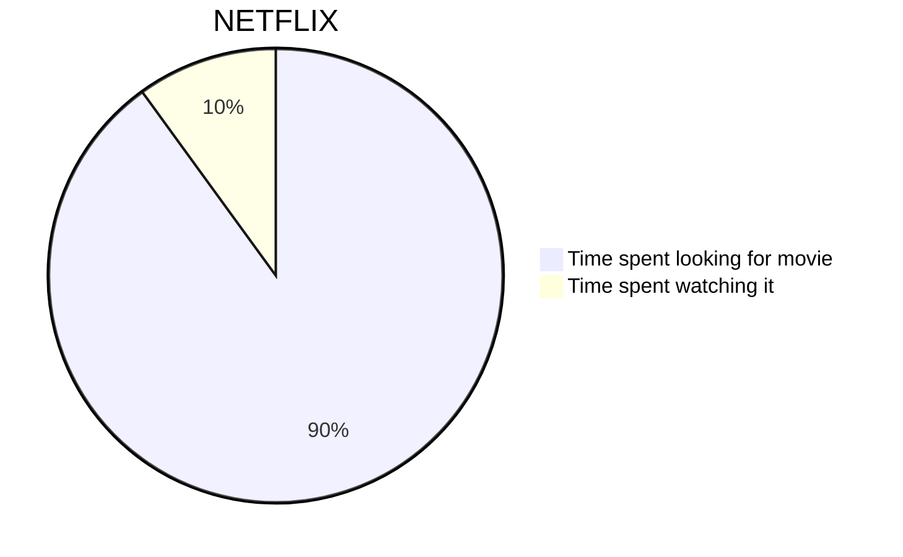

```md
pie title What Voldemort doesn't have?
         "FRIENDS" : 2
         "FAMILY" : 3
         "NOSE" : 45
```

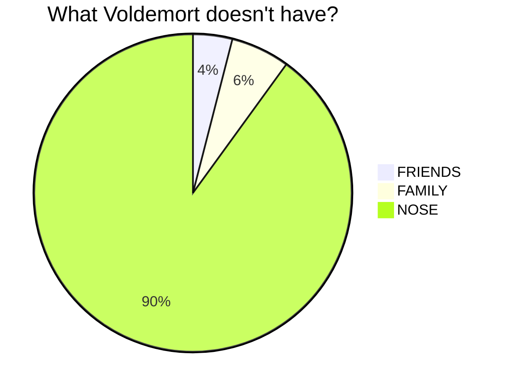

#### 基本顺序图

```md
sequenceDiagram
    Alice ->> Bob: Hello Bob, how are you?
    Bob-->>John: How about you John?
    Bob--x Alice: I am good thanks!
    Bob-x John: I am good thanks!
    Note right of John: Bob thinks a long<br/>long time, so long<br/>that the text does<br/>not fit on a row.
    
    Bob-->Alice: Checking with John...
    Alice->John: Yes... John, how are you?
```

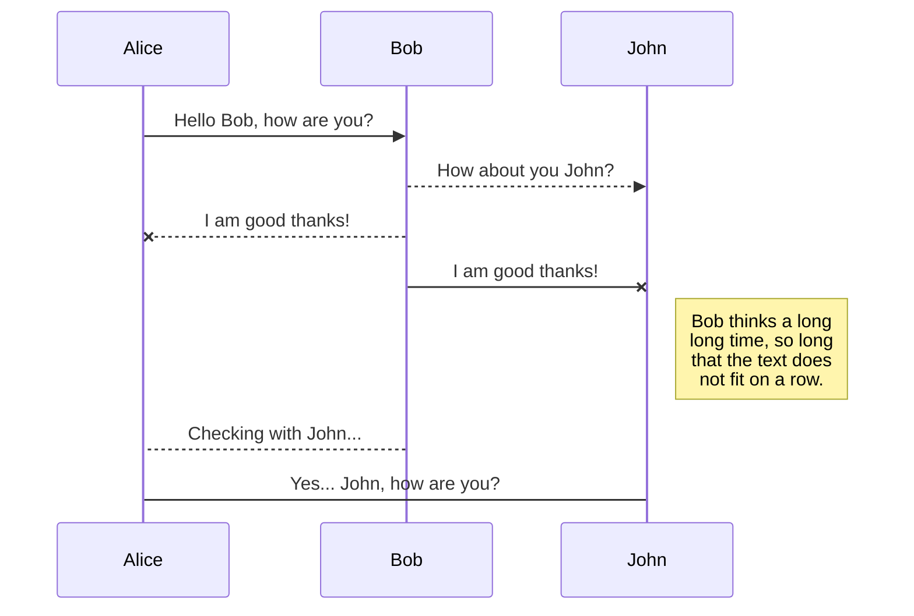

#### 基本流程图

```md
graph LR
    A[Sequence Rect] -->|Link Text| B((Circle)) --> C{Rhombus}
    A --> D(Round Rect) --> C
```

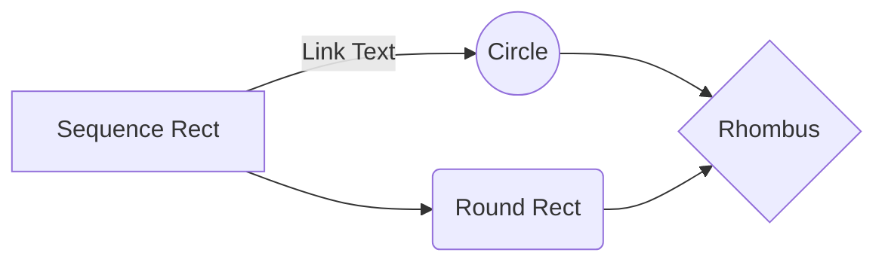

#### 具有某些样式的较大流程图

```md
graph TB
    E[Square Shape] --> F((Circle Shape))
    H((Inner / circle<br>and some odd<br>special characters)) --> I>Really long text with linebreak<br>in an Odd Shape]
    H --> J(,.?!+-*ز)
    K[Cyrillic] --> L((Circle shape Начало))
    subgraph A
        G>Odd Shape] -->|"Two line<br>edge comment"| B("Rounded<br/>square<br/>shape")
        C{Diamond with<br>line break} -.-> B
        C ==> D(Rounded square shape)
    end
    
    classDef Brown fill:#FF9967,stroke:#333,stroke-width:4px;
    classDef Green fill:#99FF66,stroke:#333,stroke-width:2px;
    class C Brown
    class E,H Green
```

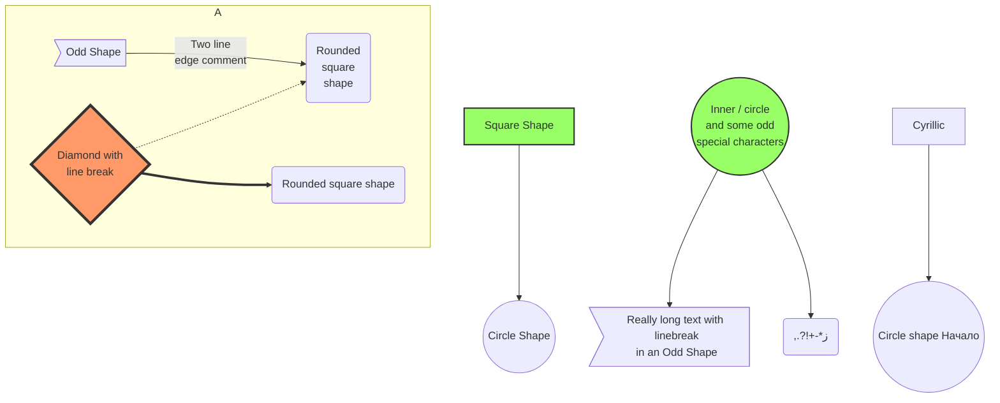

#### 循环，alt 和 opt

```md
sequenceDiagram
    loop Daily query
        Alice ->> Bob: Hello Bob, how are you?
        alt is sick
            Bob ->> Alice: Not so good:(
        else is well
            Bob ->> Alice: Feeling fresh like a daisy
        end
        opt Extra response
            Bob ->> Alice: Thanks for asking
        end
    end
```

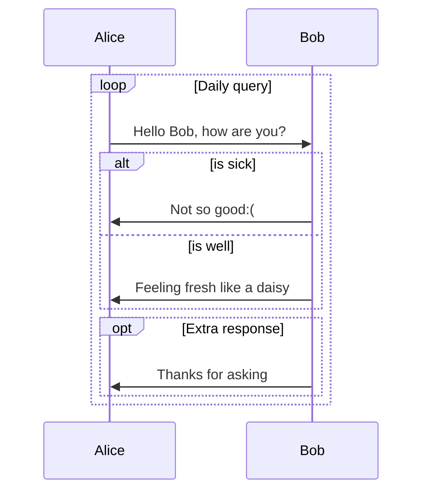

#### 自身循环留言

```md
sequenceDiagram
    participant Alice
    participant Bob
    Alice ->> John: Hello John, how are you?
    loop Healthcheck
        John ->> John: Fight against hypochondria
    end
    Note right of John: Rational thoughts<br/>prevail..
    John -->> Alice: Great!
    John ->> Bob: How about you?
    Bob -->> John: Jolly good!
```

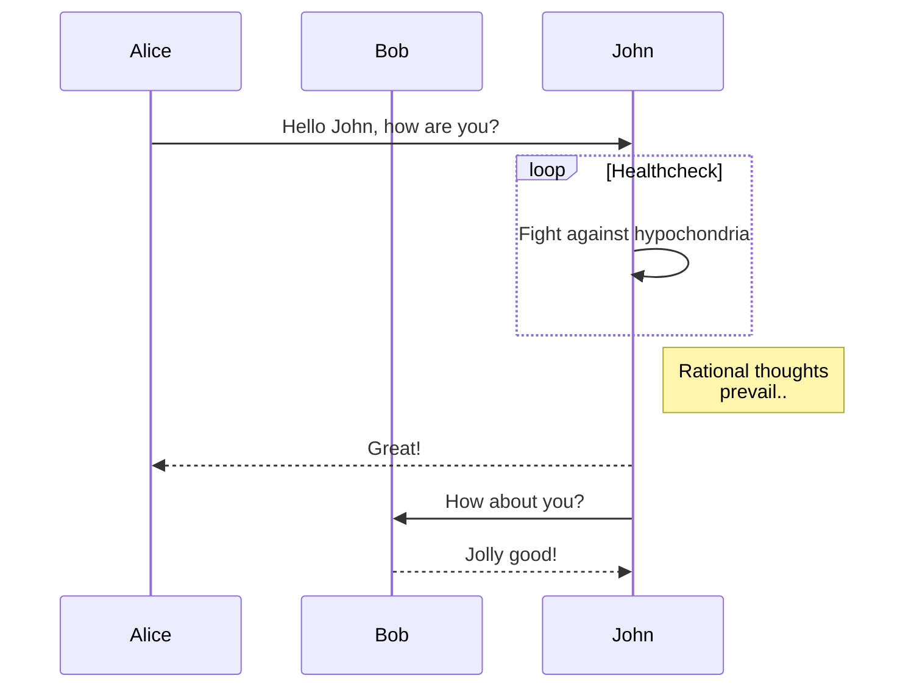

### mermaid CLI

mermaid CLI 已移至 [mermaid.cli](https://github.com/mermaidjs/mermaid.cli)。 请改为阅读其文档。

## 图表
### 流程图 - 基本语法
#### 图表（图的整体方向）

该语句声明一个新图和图形布局的方向。
这声明了一个从上到下（ `TD` 或 `TB` ）的图形。

```md
graph TD
    Start-->Stop
```

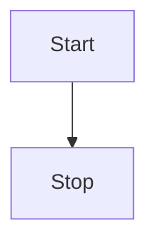

```md
graph TB
    Start-->Stop
```


这声明了一个从左到右的图形( `LR` )。

```md
graph LR 
    Start --> Stop
```

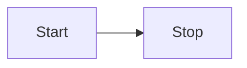

可能的方向有：

- TB - 从上到下
- BT - 从下到上
- RL - 从右到左
- LR - 从左到右
- TD - 和 TB 一样 (从上到下)

#### 节点和形状

##### 默认节点

```md
graph LR
    id
```

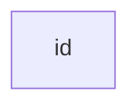

注意，id 是在节点框中显示的内容。

##### 带文本的节点

还可以在框中设置与id不同的文本。如果多次执行此操作，则将使用为节点找到的最后文本。同样，如果稍后定义节点的边缘，则可以省略文本定义。渲染框时将使用先前定义的那个。

```md
graph LR
    id1[This is the text in the box]
```

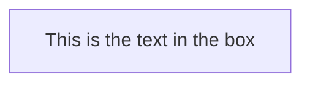

##### 具有圆边的节点

```md
graph LR
    id1(This is the text in the box)
```

```mermaid
graph LR
    id1(This is the text in the box)
```

##### 圆形的节点

```md
graph LR
    id1((This is the text in the circle))
```

```mermaid
graph LR
    id1((This is the text in the circle))
```

##### 非对称形状的节点

```md
graph LR
    id1>This is the text in the box]
```

```mermaid
graph LR
    id1>This is the text in the box]
```

目前，只有上面的形状是可能的，而不是它的镜子。*这可能会随着将来的版本而改变。*

##### 菱形节点

```md
graph LR
    id{This is the text in the box}
```

```mermaid
graph LR
    id{This is the text in the box}
```

##### 六角形节点

```md
graph LR
    id1{ {This is the text in the box} }
```

```mermaid
graph LR
    id1{ {This is the text in the box} }
```

##### 平行四边形节点

```md
graph TD
    id1[/This is the text in the box/]
```

```mermaid
graph TD
    id1[/This is the text in the box/]
```

##### 反向平行四边形节点

```md
graph TD
    id1[\This is the text in the box\]
```

```mermaid
graph TD
    id1[\This is the text in the box\]
```

##### 梯形节点

```md
graph TD
    A[/Christmas\]
```

```mermaid
graph TD
    A[/Christmas\]
```

##### 反向梯形

```md
graph TD
    B[\Go shopping/]
```

```mermaid
graph TD
    B[\Go shopping/]
```

#### 节点间的链接

节点可以通过链接/边缘连接。可以使用不同类型的链接或将文本字符串附加到链接上。

##### 带有箭头的链接

```md
graph LR
    A-->B
```

```mermaid
graph LR
    A-->B
```

##### 开放链接（两边都没有箭头的实线）

```md
graph LR
    A --- B
```

```mermaid
graph LR
    A --- B
```

##### 链接上的文字

```md
graph LR
    A-- This is the text ---B
```

```mermaid
graph LR
    A-- This is the text ---B
```

##### 带有箭头和文字的链接

```md
graph LR
    A-->|text|B
```

```mermaid
graph LR
    A-->|text|B
```

或者

```md
graph LR
    A-- text -->B
```

```mermaid
graph LR
    A-- text -->B
```

##### 虚线

```md
graph LR;
    A-.->B;
```

```mermaid
graph LR;
    A-.->B;
```

##### 带文本的虚线

```md
graph LR
    A-. text .-> B
```

```mermaid
graph LR
    A-. text .-> B
```

##### 粗箭头链接

```md
graph LR
    A ==> B
```

```mermaid
graph LR
    A ==> B
```

##### 带文本的粗箭头链接

```md
graph LR
    A == text ==> B
```

```mermaid
graph LR
    A == text ==> B
```

##### 串联箭头

可以按如下所示在同一行中声明许多链接（箭头）：

```md
graph LR
    A -- text --> B -- text2 --> C
```

```mermaid
graph LR
    A -- text --> B -- text2 --> C
```

#### 破坏语法的特殊字符

可以将文本放在引号中，以渲染更麻烦的字符。如以下示例所示：

```md
graph LR
    id1["This is the (text) in the box"]
```

```mermaid
graph LR
    id1["This is the (text) in the box"]
```

##### 实体代码转成转义字符

用如下的示例语法可以转义字符。

```md
graph LR
    A["A double quote:#quot;"] -->B["A dec char:#9829;"]
```

```mermaid
graph LR
    A["A double quote:#quot;"] -->B["A dec char:#9829;"]
```

#### 子图

```
subgraph title
    graph definition
end
```

例子如下：

```md
graph TB
    c1-->a2
    subgraph one
    a1-->a2
    end
    subgraph two
    b1-->b2
    end
    subgraph three
    c1-->c2
    end
```

```mermaid
graph TB
    c1-->a2
    subgraph one
    a1-->a2
    end
    subgraph two
    b1-->b2
    end
    subgraph three
    c1-->c2
    end
```

#### 交互

可以将click事件绑定到节点，单击可能导致JavaScript回调或在新的浏览器标签中打开一个新链接。**注意**:此功能在使用 `securityLevel='strict'` 时禁用，在使用 `securityLevel='loose'` 时启用。

```
click noteId callback
```

- noteId 是节点的id
- 回调函数是在显示图形的页面上定义的 javascript 函数的名称，将使用 nodeId 作为参数调用该函数。

以下是提示框用法的示例：

```html
<script>
    var callback = function(){
        alert('A callback was triggered');
    }
</script>
```

```mermaid
graph LR;
    A-->B;
    click A callback "Tooltip for a callback"
    click B "http://www.github.com" "This is a tooltip for a link"
```

提示框文本用双引号括起来。提示框的样式由 .mermaidTooltip 类设置。

> **成功**：从版本0.5.2开始提供提示框功能和链接到url的功能。

初学者提示，一个在html上下文中使用交互式链接的完整示例：

```html
<body>
    <div class="mermaid">
        graph LR;
            A-->B;
            click A callback "Tooltip"
            click B "http://www.github.com" "This is a link"
    </div>
    
    <script>
        var callback = function(){
            alert('A callback was triggered');
        }
        
        var config = {
            startOnLoad:true,
            flowchart:{
                useMaxWidth:true,
                htmlLabels:true,
                curve:'cardinal',
            },
            securityLevel:'loose',
        };
        
        mermaid.initialize(config);
    </script>
</body>
```

##### 注释

可以在流程图中输入注释，解析器将忽略它们。注释必须自己一行，并且必须以 `%%`（双百分号）开头。注释开始到下一个换行符之后的所有文本都将被视为注释，包括任何流程图语法。

```md
graph LR
%% this is a comment A -- text --> B{node}
    A -- text --> B -- text2 --> C
```

```mermaid
graph LR
%% this is a comment A -- text --> B{node}
    A -- text --> B -- text2 --> C
```

#### 样式和类别
##### 个性化链接

可以设置链接样式。例如，您可能想要设置在流程中向后移动的链接的样式。由于链接与节点一样没有id，因此需要另一种方法来确定链接应该附加什么样式。这里使用的是在图中定义链接时的顺序号，而不是id。在下面的示例中，linkStyle 语句中定义的样式将属于图中的第四个链接：

```
linkStyle 3 stroke:#ff3, stroke-width:4px;
```

##### 个性化节点

可以对节点应用特定的样式，如更粗的边框或不同的背景颜色。

```md
graph LR
    id1(Start)-->id2(Stop)
    style id1 fill:#f9f,stroke:#333,stroke-width:4px
    style id2 fill:#ccf,stroke:#f66,stroke-width:2px,stroke-dasharray: 5, 5
```

```mermaid
graph LR
    id1(Start)-->id2(Stop)
    style id1 fill:#f9f,stroke:#333,stroke-width:4px
    style id2 fill:#ccf,stroke:#f66,stroke-width:2px,stroke-dasharray: 5, 5
```

##### 类

与每次定义样式相比，更方便的方法是定义一个样式类并将这个类附加到应该具有不同外观的节点上。

类定义如下例所示：

```
classDef className fill:#f9f,stroke:#333,stroke-width:4px;
```

将类附加到节点的操作如下：

```
class noteId1 className;
```

也可以在一个语句中将类附加到节点列表：

```
class nodeId1,nodeId2 className;
```

##### CSS 类

还可以使用css样式的预定义类，这些类可以从图定义中应用，如下例所示：

示例样式

```html
<style>
    .cssClass > rect{
        fill:#FF0000;
        stroke:#FFFF00;
        stroke-width:4px;
    }
</style>
```

示例定义：

```md
graph LR;
    A-->B[AAA<span>BBB</span>];
    B-->D;
    class A cssClass;
```

```mermaid
graph LR;
    A-->B[AAA<span>BBB</span>];
    B-->D;
    class A cssClass;
```

##### 默认类

如果一个类被命名为default，那么它将被赋值给所有没有特定类定义的类。

```
classDef default fill:#f9f,stroke:#333,stroke-width:4px;
```

#### fontawesome 的基本支持

可以从 fontawesome 添加图标。

通过语法 `fa:#图标类名＃` 访问图标。

```md
graph TD
    B["fa:fa-twitter for peace"]
    B-->C[fa:fa-ban forbidden]
    B-->D(fa:fa-spinner);
    B-->E(A fa:fa-camera-retro perhaps?);
```

```mermaid
graph TD
    B["fa:fa-twitter for peace"]
    B-->C[fa:fa-ban forbidden]
    B-->D(fa:fa-spinner);
    B-->E(A fa:fa-camera-retro perhaps?);
```

#### 带有顶点和链接之间的空格且不带分号的图形声明

- 在图形声明中，语句现在也可以不使用分号结束。在0.2.16版本发布之后，用分号结束图形语句是可选的。因此，下面的图形声明与原来的图形声明一样有效。
- 在顶点和链接之间允许有一个单独的空格。然而，在顶点和它的文本之间，链接和它的文本之间不应该有任何空格。图形声明的旧语法也将起作用，因此，此新功能是可选的，旨在提高可读性。

下面是图形边缘的新声明，它与图形边缘的旧声明同样有效。

```md
graph LR
    A[Hard edge] -->|link text| B(Round edge)
    B -->  C(Decision)
    C -->|One| D[Result one]
    C -->|Two| E[Result two]
```

```mermaid
graph LR
    A[Hard edge] -->|link text| B(Round edge)
    B -->  C(Decision)
    C -->|One| D[Result one]
    C -->|Two| E[Result two]
```

#### 配置

可以调整渲染的流程图的宽度。

通过定义 mermaid.flowchartConfig 或通过 CLI 在配置中使用 json 文件来实现。mermaidCLI 页面中描述了如何使用 CLI。可以将 mermaid.flowchartConfig 设置为带有配置参数或相应对象的 JSON 字符串。

```js
mermaid.flowchartConfig = {
    width: 100%
}
```

### 时序图

序列图是一个交互图，它显示进程如何相互操作以及以什么顺序进行操作。

mermaid 能够渲染时序图

```md
sequenceDiagram
    Alice->>John: Hello John, how are you?
    John-->>Alice: Great!
```

```mermaid
sequenceDiagram
    Alice->>John: Hello John, how are you?
    John-->>Alice: Great!
```

#### 语法
##### 参与者

可以像本页第一个示例中那样隐式定义参与者。参与者是按照其在图源文本中的出现顺序进行渲染的。有时，您可能希望以不同于第一个消息中显示的顺序显示参与者。通过执行以下操作可以指定参与者的出现顺序：

```md
sequenceDiagram
    participant John
    participant Alice
    Alice->>John: Hello John, how are you?
    John-->>Alice: Great!
```

```mermaid
sequenceDiagram
    participant John
    participant Alice
    Alice->>John: Hello John, how are you?
    John-->>Alice: Great!
```

##### 别名

参与者可以有一个方便的标识符和一个描述性标签。

```md
sequenceDiagram
    participant A as Alice
    participant J as John
    A->>J: Hello John, how are you?
    J->>A: Great!
```

```mermaid
sequenceDiagram
    participant A as Alice
    participant J as John
    A->>J: Hello John, how are you?
    J->>A: Great!
```

#### 消息

消息可以用实线显示，也可以用虚线显示。

```
[Actor][Arrow][Actor]:Message text
```

目前支持 6 种类型的箭头：

| 类型 | 描述 |
| :-: | :-: |
| ->  | 不带箭头的实线 |
| --> | 不带箭头的虚线 |
| ->> | 带箭头的实线 |
| —->> | 带箭头的虚线 |
| -x | 末端带有叉号的实线(异步)  |
| —-x | 末端带有叉号的虚线(异步)  |

#### 激活

可以激活和停用角色。(停用)激活可以专门声明:

```md
sequenceDiagram
    Alice->>John: Hello John, how are you?
    activate John
    John-->>Alice: Great!
    deactivate John
```

```mermaid
sequenceDiagram
    Alice->>John: Hello John, how are you?
    activate John
    John-->>Alice: Great!
    deactivate John
```

还可以通过在消息箭头后添加 `+`/`-` 后缀来表示快捷方式：(看不出来有什么区别)

```md
sequenceDiagram
    Alice->>+John: Hello John, how are you?
    John-->>-Alice: Great!
```

```mermaid
sequenceDiagram
    Alice->>+John: Hello John, how are you?
    John-->>-Alice: Great!
```

可以为同一参与者堆叠激活：

```md
sequenceDiagram
    Alice->>+John: Hello John, how are you?
    Alice->>+John: John, can you hear me?
    John-->>-Alice: Hi Alice, I can hear you!
    John-->>-Alice: I feel great!
```

```mermaid
sequenceDiagram
    Alice->>+John: Hello John, how are you?
    Alice->>+John: John, can you hear me?
    John-->>-Alice: Hi Alice, I can hear you!
    John-->>-Alice: I feel great!
```

#### 说明

可以给时序图添加说明。表示语法：Note [right of|left of|over][Actor]: 说明内容中的文本

如下例所示：

```md
sequenceDiagram
    participant John
    Note right of John: Text in note
```

```mermaid
sequenceDiagram
    participant John
    Note right of John: Text in note
```

也可以创建跨越两个参与者的说明：

```md
sequenceDiagram
    Alice->John: Hello John, how are you?
    Note over Alice,John: A typical interaction
```

```mermaid
sequenceDiagram
    Alice->John: Hello John, how are you?
    Note over Alice,John: A typical interaction
```

#### 循环

可以在顺序图中表示循环。这是由以下表示语法完成的：

```
loop Loop text
... statements ...
end
```

如下例所示：

```md
sequenceDiagram
    Alice->John: Hello John, how are you?
    loop Every minute
        John-->Alice: Great!
    end
```

```mermaid
sequenceDiagram
    Alice->John: Hello John, how are you?
    loop Every minute
        John-->Alice: Great!
    end
```

#### 多选路径+可选路径（Alt）

可以在时序图中表示可供替代的路径。由如下表示语法实现：

```
alt Describing text
... statements ...
else
... statements ...
end
```

或者序列是可选的(如果没有 else )。

```
opt Describing text
... statements ...
end
```

如下例所示：

```md
sequenceDiagram
    Alice->>Bob: Hello Bob, how are you?
    alt is sick
        Bob->>Alice: Not so good :(
    else is well
        Bob->>Alice: Feeling fresh like a daisy
    end
    opt Extra response
        Bob->>Alice: Thanks for asking
    end
```

```mermaid
sequenceDiagram
    Alice->>Bob: Hello Bob, how are you?
    alt is sick
        Bob->>Alice: Not so good :(
    else is well
        Bob->>Alice: Feeling fresh like a daisy
    end
    opt Extra response
        Bob->>Alice: Thanks for asking
    end
```

看例子很容易明白，alt 适用于时序图在回应的时候有多种条件需要判断；opt 适用于时序图在回应时可以增加的额外回应（可以不回应）。

#### 背景高亮

通过提供彩色背景矩形可以突出显示流程。由以下表示法实现。使用 rgb 和 rgba 语法定义颜色。

```
rect rgb(0, 255, 0)
... content ...
end
```

```
rect rgba(0, 0, 255, .1)
... content ...
end
```

如下例所示：

```md
sequenceDiagram
    rect rgb(191, 223, 255)
        Note right of Alice: Alice calls John.
        Alice->>+John: Hello John, how are you?
        rect rgb(200, 150, 255)
            Alice->>+John: John, can you hear me?
            John-->>-Alice: Hi Alice, I can hear you!
        end
        John-->>-Alice: I feel great!
    end
    Alice->>+John: Did you want to go to the game tonight?
    John-->>-Alice: Yeah! See you there.
```

```mermaid
sequenceDiagram
    rect rgb(191, 223, 255)
        Note right of Alice: Alice calls John.
        Alice->>+John: Hello John, how are you?
        rect rgb(200, 150, 255)
            Alice->>+John: John, can you hear me?
            John-->>-Alice: Hi Alice, I can hear you!
        end
        John-->>-Alice: I feel great!
    end
    Alice->>+John: Did you want to go to the game tonight?
    John-->>-Alice: Yeah! See you there.
```

#### 注释

可以在时序图中输入注释，解析器将忽略它们。注释必须自己一行，并且必须以 `%%`（双百分号）开头。注释开始到下一个换行符之后的任何文本都将被视为注释，包括任何图语法.

```md
sequenceDiagram
    Alice->>John: Hello John, how are you?
    %% this is a comment
    John-->>Alice: Great!
```

```mermaid
sequenceDiagram
    Alice->>John: Hello John, how are you?
    %% this is a comment
    John-->>Alice: Great!
```

#### 样式

时序图的样式是通过定义多个CSS类来完成的。在渲染期间，这些类是从位于 src/themes/sequence.scss 文件中提取的。

##### 使用的类

| 类 | 描述 |
| --- | --- |
| actor | 图表顶部的actor框的样式。 |
| text.actor | 图表顶部的actor框中的文本的样式。 |
| actor-line | 参与者垂直的线。 |
| messageLine0 | 实线消息行的样式。 |
| messageLine1 | 虚线消息行的样式。 |
| messageText | 定义消息箭头上文本的样式。 |
| labelBox | 定义循环中向左的样式标签。 |
| labelText | 循环标签中的文本样式。 |
| loopText | 循环框中文本的样式。 |
| note | 说明框的样式。 |
| noteText | 说明框中的文本的样式。 |

##### 样式表例子

```css
body {
    background: white;
}

.actor {
    stroke: #CCCCFF;
    fill: #ECECFF;
}
text.actor {
    fill: black;
    stroke: none;
    font-family: Helvetica;
}

.actor-line {
    stroke: grey;
}

.messageLine0 {
    stroke-width: 1.5;
    stroke-dasharray: "2 2";
    marker-end: "url(#arrowhead)";
    stroke: black;
}

#arrowhead {
    fill: black;
}

.messageText {
    fill: black;
    stroke: none;
    font-family: 'trebuchet ms', verdana, arial;
    font-size: 14px;
}

.labelBox {
    stroke: #CCCCFF;
    fill: #ECECFF;
}

.labelText {
    fill:black;
    stroke:none;
    font-family: 'trebuchet ms', verdana, arial;
}

.loopText {
    fill:black;
    stroke:none;
    font-family: 'trebuchet ms', verdana, arial;
}

.loopLine {
    stroke-width:2;
    stroke-dasharray: "2 2";
    marker-end:"url(#arrowhead)";
    stroke: #CCCCFF;
}

.note {
    stroke: #decc93;
    stroke: #CCCCFF;
    fill: #fff5ad;
}

.noteText {
    fill:black;
    stroke:none;
    font-family: 'trebuchet ms', verdana, arial;
    font-size:14px;
}
```

#### 配置

是否可以调整绘制时序图的边距。

通过定义 mermaid.sequenceConfig 或通过 CLI 在配置中使用 json 文件来实现。[mermaidCLI](https://mermaid-js.github.io/mermaid/#/mermaidCLI.html) 页面中描述了如何使用 CLI。可以将 mermaid.sequenceConfig 设置为带有配置参数的JSON字符串或相应对象。

```js
mermaid.sequenceConfig = {
    diagramMarginX: 50,
    diagramMarginY: 10,
    boxTextMargin: 5,
    noteMargin: 10,
    messageMargin: 35,
    mirrorActors: true
}
```

##### 可能的配置参数：

| 参数 | 描述 | 默认值 |
| :-: | :-: | :-: |
| mirrorActor | 打开/关闭图表下面和上面的参与者的渲染 | false |
| bottomMarginAdj | 调整图形结束的距离。 使用CSS的宽边框样式可能会产生不必要的裁剪，这就是存在此配置参数的原因。 | 1 |

### 类图

> “在软件工程中，统一建模语言(UML)中的类图是一种静态结构图，它通过显示系统的类、它们的属性、操作(或方法)以及对象之间的关系来描述系统的结构。” 维基百科。

类图是面向对象建模的主要构建块。它用于应用程序结构的一般概念建模，以及用于将模型转换为编程代码的详细建模。类图也可以用于数据建模。类图中的类表示主要元素，应用程序中的交互以及要编程的类。

Mermaid 可以渲染类图。

```md
 classDiagram
      Animal <|-- Duck
      Animal <|-- Fish
      Animal <|-- Zebra
      Animal : +int age
      Animal : +String gender
      Animal: +isMammal()
      Animal: +mate()
      class Duck{
          +String beakColor
          +swim()
          +quack()
      }
      class Fish{
          -int sizeInFeet
          -canEat()
      }
      class Zebra{
          +bool is_wild
          +run()
      }
```

```mermaid
 classDiagram
      Animal <|-- Duck
      Animal <|-- Fish
      Animal <|-- Zebra
      Animal : +int age
      Animal : +String gender
      Animal: +isMammal()
      Animal: +mate()
      class Duck{
          +String beakColor
          +swim()
          +quack()
      }
      class Fish{
          -int sizeInFeet
          -canEat()
      }
      class Zebra{
          +bool is_wild
          +run()
      }
```

#### 语法
##### 类

UML提供了表示类成员的机制，例如属性和方法，以及有关它们的其他信息。图中一个类的单独实例包含三个部分:

- 顶部的小节包含类的名称。它以粗体和居中方式打印，并且第一个字母大写。它还可能包含描述类性质的可选注释文本。
- 中间部分包含类的属性。它们是左对齐的，第一个字母是小写的。
- 底部的小节包含类可以执行的操作。它们也是左对齐的，第一个字母是小写的。

```md
classDiagram
    class BankAccount
    BankAccount : +String owner
    BankAccount : +Bigdecimal balance
    BankAccount : +deposit(amount)
    BankAccount : +withdrawl(amount)
```

```mermaid
classDiagram
    class BankAccount
    BankAccount : +String owner
    BankAccount : +Bigdecimal balance
    BankAccount : +deposit(amount)
    BankAccount : +withdrawl(amount)
```

#### 定义类

定义类有两种方法：

- 使用关键字 **class** (如 `class Animal`)显式定义类。这定义了动物类
- 通过它们之间的关系定义两个类: `Vehicle <|-- Car` 。这定义了两个类 Vehicle 和 Car 及其关系。

```md
classDiagram
    class Animal
    Vehicle <|-- Car
```

```mermaid
classDiagram
    class Animal
    Vehicle <|-- Car
```

命名约定：类名应由含字母和数字（允许使用 Unicode ）和下划线的字符组成。

#### 定义类的成员

UML提供了表示类成员的机制，例如属性和方法，以及有关它们的其他信息。

##### 可见性

为了指定类成员（即任何属性或方法）的可见性，可以将这些符号放在成员名称的前面，但是它是可选的：

- `+` Public（公有）
- `-` Private（私有）
- `#` Protected（保护）
- `~` Package（包）

mermaid 根据括号 `()` 是否存在来区分属性和函数/方法。带有 () 的被视为函数/方法，其他的被视为属性。

定义类的成员有两种方法，无论使用哪种语法定义成员，输出都将相同。这两种不同的方式是:

- 使用:（冒号）后跟成员名称来关联一个类的成员，适用于一次定义一个成员。 例如：

```md
classDiagram
    class BankAccount
    BankAccount : +String owner
    BankAccount : +BigDecimal balance
    BankAccount : +deposit(amount)
    BankAccount : +withdrawl(amount)
```

```mermaid
classDiagram
    class BankAccount
    BankAccount : +String owner
    BankAccount : +BigDecimal balance
    BankAccount : +deposit(amount)
    BankAccount : +withdrawl(amount)
```

- 使用 {} 括号将类的成员相关联，其中成员分组在花（大）括号中。适用于一次定义多个成员。 例如：

```md
classDiagram
    class BankAccount{
        +String owner
        +BigDecimal balance
        +deposit(amount)
        +withdrawl(amount)
    }
```

```mermaid
classDiagram
    class BankAccount{
        +String owner
        +BigDecimal balance
        +deposit(amount)
        +withdrawl(amount)
    }
```

#### 定义关系

关系是一个通用术语，涵盖类和对象图中发现的特定类型的逻辑连接。

```
[classA][Arrow][ClassB]:LabelText
```

UML 中为类定义了不同类型的关系，以下关系目前是受支持的：

| 类型 | 描述 |
| :-: | :-: |
| <\|-- | 继承 |
| *-- | 组合 |
| o-- | 聚合 |
| --> | 关联 |
| ..> | 关联 |
| -- | 链接 |
| .. | 链接 |

```md
classDiagram
    classA <|-- classB
    classC *-- classD
    classE o-- classF
    classG <-- classH
    classI <.. classJ
    classK .. classL
```

```mermaid
classDiagram
    classA <|-- classB
    classC *-- classD
    classE o-- classF
    classG <-- classH
    classI <.. classJ
    classK .. classL
```

我们也可以使用相反方向的箭头：

```md
classDiagram
    classA --|> classB
    classC --* classD
    classE --o classF
    classG <--> classH
    classI ..> classJ
    classK .. classL
```

```mermaid
classDiagram
    classA --|> classB
    classC --* classD
    classE --o classF
    classG <--> classH
    classI ..> classJ
    classK .. classL
```

#### 在关系上添加标签文本

可以在关系中添加标签文本：

```
[classA][Arrow][ClassB]:LabelText
```

```md
classDiagram
    classA <|-- classB : implements
    classC *-- classD : composition
    classE o-- classF : association
```

```mermaid
classDiagram
    classA <|-- classB : implements
    classC *-- classD : composition
    classE o-- classF : association
```

#### 关系上的基数/多重性

类图中的多重性或基数性表示一个类链接到另一个类实例的实例数量。例如，一个公司将有一个或多个员工，但是每个员工只为一个公司工作。（一个类将有一个或多个实例，但是每个实例只属于一个类）

多重符号位于关联的结尾附近。

不同的基数选项有：

- `0..1` 0 或 1
- `1` 只有 1
- `1..*` 1 或 更多
- `*` 许多
- `n` n {n > 1}
- `0..n` 0 到 n {n > 1}
- `1..n` 1 到 n {n > 1}

通过在给定箭头之前(可选)和之后(可选)的引号 `"` 中放置基数文本，可以轻松定义基数。

```
[classA] "cardinality1" [Arrow] "cardinality2" [classB]:LabelText
```

```md
classDiagram
    Customer "1" --> "*" Ticket
    Student "1" --> "1..*" Course
    Galaxy --> "many" Star : Contains
```

```mermaid
classDiagram
    Customer "1" --> "*" Ticket
    Student "1" --> "1..*" Course
    Galaxy --> "many" Star : Contains
```

#### 类注释(在 MWeb软件 中不起作用)

可以使用特定的标记文本为类添加注释，该标记文本类似于该类的元数据，可以清楚地指示其性质。

- `<<Interface>>` 表示接口类
- `<<abstract>>` 表示抽象类
- `<<Service>>` 表示服务类
- `<<enumeration>>` 表示枚举

注释是在开始 `<<` 和结束 `>>` 中定义的。有两种向类添加注释的方法，无论使用哪种语法，输出都将相同。这两种方式是：

- 在类定义后的单独一行中。例如:
 
 ```md
classDiagram
    class Shape
        <<interface>> Shape
```
 
```mermaid
classDiagram
    class Shape
    <<interface>> Shape
```

- 与类定义一起放在嵌套结构中。例如:

```md
classDiagram
    class Shape {
        <<interface>>
        noOfVertices
        draw()    
    }
    class Color {
        <<enumeration>>
        RED
        BLUE
        GREEN
        WHITE
        BLACK
    }
```

```mermaid
classDiagram
    class Shape {
        <<interface>>
        noOfVertices
        draw()    
    }
    class Color {
        <<enumeration>>
        RED
        BLUE
        GREEN
        WHITE
        BLACK
    }
```

#### 注释

可以在类图中输入注释，解析器将忽略它们。注释必须自己一行，并且必须以 `%%`（双百分号）开头。注释开始到下一个换行符之后的任何文本都将被视为注释，包括任何图语法.

```md
classDiagram
%% This whole line is a comment classDiagram class Shape <<interface>>
class Shape{
    <<interface>>
    noOfVertices
    draw()
}
```

```mermaid
classDiagram
%% This whole line is a comment classDiagram class Shape <<interface>>
class Shape{
    <<interface>>
    noOfVertices
    draw()
}
```

#### 样式

时序图的样式是通过定义多个CSS类来完成的。在渲染期间，这些类是从位于 src/themes/sequence.scss 文件中提取的。

##### 使用的样式类

| 类 | 描述 |
| :-: | :-: |
| g.classGroup text | 通用类文本样式 |
| classGroup .title | 通用类标题样式 |
| g.classGroup rect | 类图矩形的样式 |
| g.classGroup line | 类图线的样式 |
| .classLabel .box | 类标签框的样式 |
| .classLabel .label | 类标签文本的样式 |
| composition  | 组合箭头和箭头线的样式 |
| aggregation | 聚合箭头和箭头线(虚线或实线)的样式 |
| dependency | 依赖箭头和箭头线的样式 |

##### 样式表例子

```css
body {
    background: white;
}

g.classGroup text {
  fill: $nodeBorder;
  stroke: none;
  font-family: 'trebuchet ms', verdana, arial;
  font-family: var(--mermaid-font-family);
  font-size: 10px;

  .title {
    font-weight: bolder;
  }
}

g.classGroup rect {
  fill: $nodeBkg;
  stroke: $nodeBorder;
}

g.classGroup line {
  stroke: $nodeBorder;
  stroke-width: 1;
}

.classLabel .box {
  stroke: none;
  stroke-width: 0;
  fill: $nodeBkg;
  opacity: 0.5;
}

.classLabel .label {
  fill: $nodeBorder;
  font-size: 10px;
}

.relation {
  stroke: $nodeBorder;
  stroke-width: 1;
  fill: none;
}

@mixin composition {
  fill: $nodeBorder;
  stroke: $nodeBorder;
  stroke-width: 1;
}

#compositionStart {
  @include composition;
}

#compositionEnd {
  @include composition;
}

@mixin aggregation {
  fill: $nodeBkg;
  stroke: $nodeBorder;
  stroke-width: 1;
}

#aggregationStart {
  @include aggregation;
}

#aggregationEnd {
  @include aggregation;
}

#dependencyStart {
  @include composition;
}

#dependencyEnd {
  @include composition;
}

#extensionStart {
  @include composition;
}

#extensionEnd {
  @include composition;
}
```

> 这是 Sass 中的语法特点。Sass ：Syntactically Awesome Stylesheets。它是一个 CSS 预处理器。
> @mixin 指令允许我们定义一个可以在整个样式表中重复使用的样式。
> @include 指令可以将混入（mixin）引入到文档中。

#### 配置
`即将来临`

### 状态图

> 状态图是计算机科学及相关领域中用于描述系统行为的一种图。状态图要求所描述的系统由有限数量的状态组成；有时候确实是这样，而在其他时候则是合理的抽象。” 维基百科

mermaid 可以渲染状态图。语法尝试与plantUml中使用的语法兼容，因为这将使用户更容易在 mermaid 和 plantUml 之间共享图表。

```markdown
stateDiagram
    [*] --> Still
    Still --> [*]
    
    Still --> Moving
    Moving --> Still
    Moving --> Crash
    Crash --> [*]
```

```mermaid
stateDiagram
    [*] --> Still
    Still --> [*]
    
    Still --> Moving
    Moving --> Still
    Moving --> Crash
    Crash --> [*]
```

在状态图中，根据其状态以及系统状态如何通过转换，转变为另一种状态来描述系统。上面的示例图显示了三个状态：**Still**，**Moving** 和 **Crash**。您可以从 Sitll 状态更改为 Moving。在 Moving 状态中，您可以将状态更改回 Still 或 Crash。没有从 Still 到 Crash 的转换。

#### 状态

可以通过多种方式声明状态。最简单的方法是将状态ID定义为描述。

```md
stateDiagram
    s1
```

```mermaid
stateDiagram
    s1
```

另一种方法是使用带说明的 state 关键字，其说明如下：

```md
stateDiagram
    state "This is a state description" as s2
```

```mermaid
stateDiagram
    state "This is a state description" as s2
```

定义带描述的状态的另一种方法是定义状态ID，后跟冒号和描述：

```md
stateDiagram
    s2 : This is a state description
```

```mermaid
stateDiagram
    s2 : This is a state description
```

#### 转换
转换是一种状态进入另一种状态时的路径/边缘。使用文本箭头 ”-->” 表示。

当您定义两个状态之间的转换且尚未定义状态时，将使用转换中的ID定义未定义状态。稍后您可以向以这种方式定义的状态添加描述。

```md
stateDiagram
    s1 --> s2
```

```mermaid
stateDiagram
    s1 --> s2
```

可以向转换添加文本。 描述它代表什么。

```md
stateDiagram
    s1 --> s2: A transition
```

```mermaid
stateDiagram
    s1 --> s2: A transition
```

#### 开始和结束

有两种特殊状态指示图的开始和停止。这些都是用 [*] 语法编写的，转换到它的方向将其定义为开始或停止状态。

```md
stateDiagram
    [*] --> s1
    s1 --> [*]
```

```mermaid
stateDiagram
    [*] --> s1
    s1 --> [*]
```

#### 复合状态

在现实世界中使用状态图时，您通常会遇到多维图，因为一个状态可以具有多个内部状态。这些在本术语中称为复合状态。

为了定义一个复合状态，您需要使用state关键字，后跟id，以及{}之间的复合状态的主体。

```md
stateDiagram
    [*] --> First
    state First {
        [*] --> second
        second --> [*]
    }
```

```mermaid
stateDiagram
    [*] --> First
    state First {
        [*] --> second
        second --> [*]
    }
```

您可以分几层进行操作：

```md
stateDiagram
    [*] --> First
    
    state First {
        [*] --> Second
        
        state Second {
            [*] --> second
            second --> Third
            
            state Third {
                [*] --> third
                third --> [*]
            }
        }
    }
```

```mermaid
stateDiagram
    [*] --> First
    
    state First {
        [*] --> Second
        
        state Second {
            [*] --> second
            second --> Third
            
            state Third {
                [*] --> third
                third --> [*]
            }
        }
    }
```

您还可以在复合状态之间定义转换：

```md
stateDiagram
    [*] --> First
    First --> Second
    First --> Third
    
    state First {
        [*] --> fir
        fir --> [*]
    }
    
    state Second {
        [*] --> sec
        sec --> [*]
    }
    
    state Third {
        [*] --> thi
        thi --> [*]
    }
```

```mermaid
stateDiagram
    [*] --> First
    First --> Second
    First --> Third
    
    state First {
        [*] --> fir
        fir --> [*]
    }
    
    state Second {
        [*] --> sec
        sec --> [*]
    }
    
    state Third {
        [*] --> thi
        thi --> [*]
    }
```

#### 分叉(在 MWeb软件 中不起作用)

可以使用 <<fork>> <<join>>在图中指定一个分叉。

```md
stateDiagram
    state fork_state <<fork>>
    [*] --> fork_state
    fork_state --> State2
    fork_state --> State3
    
    state join_state <<join>>
    State2 --> join_state
    State3 --> join_state
    join_state --> State4
    State4 --> [*]
```

```mermaid
stateDiagram
    state fork_state <<fork>>
      [*] --> fork_state
      fork_state --> State2
      fork_state --> State3

      state join_state <<join>>
      State2 --> join_state
      State3 --> join_state
      join_state --> State4
      State4 --> [*]
```

#### 笔记

有时候没有什么比笔记更能说明问题了。状态图中也是如此。
在这里，您可以选择将笔记放在节点的右侧或左侧。

```md
stateDiagram
    State1: The state with a note
    note right of State1
        Important information! You can write
        notes.
    end note
    State1 --> State2
    note left of State2 : This is the note to the left
```

```mermaid
stateDiagram
    State1: The state with a note
    note right of State1
        Important information! You can write
        notes.
    end note
    State1 --> State2
    note left of State2 : This is the note to the left.
```

#### 并发性

在 plantUml 中您可以使用 -- 符号指定并发性。

```md
stateDiagram
        [*] --> Active

        state Active {
            [*] --> NumLockOff
            NumLockOff --> NumLockOn : EvNumLockPressed
            NumLockOn --> NumLockOff : EvNumLockPressed
            --
            [*] --> CapsLockOff
            CapsLockOff --> CapsLockOn : EvCapsLockPressed
            CapsLockOn --> CapsLockOff : EvCapsLockPressed
            --
            [*] --> ScrollLockOff
            ScrollLockOff --> ScrollLockOn : EvCapsLockPressed
            ScrollLockOn --> ScrollLockOff : EvCapsLockPressed
        }
```

```mermaid
stateDiagram
        [*] --> Active

        state Active {
            [*] --> NumLockOff
            NumLockOff --> NumLockOn : EvNumLockPressed
            NumLockOn --> NumLockOff : EvNumLockPressed
            --
            [*] --> CapsLockOff
            CapsLockOff --> CapsLockOn : EvCapsLockPressed
            CapsLockOn --> CapsLockOff : EvCapsLockPressed
            --
            [*] --> ScrollLockOff
            ScrollLockOff --> ScrollLockOn : EvCapsLockPressed
            ScrollLockOn --> ScrollLockOff : EvCapsLockPressed
        }
```

#### 注释

可以在状态图表中输入注释，解析器将会忽略它们。注释必须单独一行，并且必须以 `%%` 开头（双百分号）开头。从注释开始后到下一个换行为止的任何文本都将被当做注释，包括任何图语法。

```md
stateDiagram
    [*] --> Still
    Still --> [*]
    %% this is a comment
    Still --> Moving
    Moving --> Still %% another comment
    Moving --> Crash
    Crash --> [*]
```

```mermaid
stateDiagram
    [*] --> Still
    Still --> [*]
    %% this is a comment
    Still --> Moving
    Moving --> Still %% another comment
    Moving --> Crash
    Crash --> [*]
```

#### 样式

状态图的样式是通过定义多个 css 类来完成的。在渲染时，这些类从位于 src/themes/state.scss 文件中提取。

### 甘特图

> 甘特图是一种条形图，最早由卡罗尔·阿达米基(Karol Adamiecki)在1896年开发，并在1910年代由亨利·甘特(Henry Gantt)独立开发，它说明了一个项目的时间表。

Mermaid 可以渲染甘特图。

```md
gantt
    title A Gantt Diagram
    dateFormat YYYY-MM-DD
    section Section
    A task          :a1, 2014-01-01, 30d
    Another task    :after a1, 20d
    section Another
    Task in sec     :2014-01-12, 12d
    another task    : 24d
```

```mermaid
gantt
    title A Gantt Diagram
    dateFormat YYYY-MM-DD
    section Section
    A task          :a1, 2014-01-01, 30d
    Another task    :after a1, 20d
    section Another
    Task in sec     :2014-01-12, 12d
    another task    : 24d
```

#### 语法

```md
gantt
    dateFormat YYYY-MM-DD
    title Adding GANTT diagram functionality to mermaid
    
    section A section
    Completed task      :done,   des1, 2014-01-06, 2014-01-08
    Active task         :active, des2, 2014-01-09, 3d
    Future task         :        des3, after des2, 5d
    Future task2        :        des4, after des3, 5d
    
    section Critical tasks
    Completed task in the critical line :crit, done, 2014-01-06, 24h
    Implement parser and jison          :crit, done, after des1, 2d
    Create tests for parser             :crit, active, 3d
    Future task in critical line        :crit, 5d
    Create tests for renderer           :2d
    Add to mermaid                      :1d
    
    section Documentation
    Describe gantt syntax               :active, a1, after des1, 3d
    Add gantt diagram to demo page      :after a1, 20h
    Add another diagram to demo page    :doc1, after a1, 48h
    
    section Last section
    Describe gantt syntax               :after doc1, 3d
    Add gantt diagram to demo page      :20h
    Add another diagram to demo page    :48h
```

```mermaid
gantt
    dateFormat YYYY-MM-DD
    title Adding GANTT diagram functionality to mermaid
    
    section A section
    Completed task      :done,   des1, 2014-01-06, 2014-01-08
    Active task         :active, des2, 2014-01-09, 3d
    Future task         :        des3, after des2, 5d
    Future task2        :        des4, after des3, 5d
    
    section Critical tasks
    Completed task in the critical line :crit, done, 2014-01-06, 24h
    Implement parser and jison          :crit, done, after des1, 2d
    Create tests for parser             :crit, active, 3d
    Future task in critical line        :crit, 5d
    Create tests for renderer           :2d
    Add to mermaid                      :1d
    
    section Documentation
    Describe gantt syntax               :active, a1, after des1, 3d
    Add gantt diagram to demo page      :after a1, 20h
    Add another diagram to demo page    :doc1, after a1, 48h
    
    section Last section
    Describe gantt syntax               :after doc1, 3d
    Add gantt diagram to demo page      :20h
    Add another diagram to demo page    :48h
```

#### 标题

待定

#### 节声明

待定

#### 设置日期

待定

##### 日期格式

默认的日期格式是 YYYY-MM-DD。您可以自定义 `dateFormat`。例如：

```
dateFormat YYYY MM DD
```

##### 图定义

输入示例说明：

```md
YYYY    2014    4位数的年份
YY      14      2位数的年份
Q       1..4    4分之一的年。将月份设置为季度的第一个月。
M MM    1..12   月数
MMM MMMM    January...Dec   通过moment.locale()设置的地区中的月份名称
D DD    1..31   每月的天数
Do      1st..31st   每月第几天
DDD DDDD    1..365  每年的天数
X       1410715640.579      Unix 时间戳
x       1410715640579       Unix 毫秒时间戳
```

| 输入 | 示例 | 描述 |
| :-: | :-: | :-: |
| H HH | 0..23 | 24小时时间 |
| h hh | 1..12 | 和 A.(am.上午) 一起使用的 12 小时时间 |
| a A | am pm | 午前(上午)或午后(下午) |
| m mm | 0..59 | 分钟 |
| s ss | 0..59 | 秒 |
| S | 0..9 | 十分之一秒 |
| SS | 0.99 | 百分之一秒 |
| SSS | 0..999 | 千分之一秒 |
| Z ZZ | +12:00 | 与UTC的偏移量，如：+-HH:mm， +-HHmm，或Z |

有关更多信息，请访问：http://momentjs.com/docs/#/parsing/string-format/

##### 格式化符号

```
%a - 工作日的缩写名称。
%A - 完整的工作日名称。
%b - 缩写的月份名称
%B - 完整的月份名称
%c - 日期和时间，例如 “%a %b %e %H:%M:%S %Y”。
%d - 以十进制数字[01,31]表示的一个月的零填充日。
%e - 以十进制数字[ 1,31]表示的月份的天;相当于 %_d。
%H - 以十进制数[00, 23]表示的小时（24 小时制）。
%I - 以十进制数[01, 12]表示的小时（12 小时制）。
%j - 以十进制数[001, 366]表示的一年的天数。
%m - 以十进制数[01, 12]表示的月份。
%M - 以十进制数[00, 59]表示的分钟数。
%L - 以十进制数[000, 999]表示的毫秒数。
%p - 上午(AM)或下午(PM)。
%S - 以十进制数[00, 61]表示的秒数。
%U - 以十进制数[00, 53]表示的一年中的周数（星期日为一周的第一天）。
%w - 以十进制数[0(星期日), 6]表示的星期数。
%W - 以十进制数[00, 53]表示的一年中的周数（星期一为一周的第一天）。
%x - 日期，例如 “%m/%d/%Y”
%X - 时间，例如 “%H:%M:%S”
%y - 以十进制数[00, 99]表示的不带世纪的年。
%Y - 以十进制数表示的带世纪的年。
%Z - 时区偏移，例如 “-0700”
%% - 一个原义“%”字符。
```

有关更多信息，请访问：https://github.com/mbostock/d3/wiki/Time-Formatting

#### 注释

可以在甘特图中输入注释，解析器将忽略它们。注释必须单起一行，并且必须以 `%%` （双百分号）开头。在注释开始到下一行后的任何文本都会被当做注释对待，包含任何图语法。

```md
gantt
    title A Gantt Diagram
    %% this is a comment
    dateFormat YYYY-MM-DD
    section Section
    A task          :a1, 2014-01-01, 30d
    Another task    :after a1, 20d
    section Another
    Task in sec     :2014-01-12, 12d
    another task    :24d
```

```mermaid
gantt
    title A Gantt Diagram
    %% this is a comment
    dateFormat YYYY-MM-DD
    section Section
    A task          :a1, 2014-01-01, 30d
    Another task    :after a1, 20d
    section Another
    Task in sec     :2014-01-12, 12d
    another task    :24d
```

#### 样式

甘特图的样式是通过定义多个 css 类来完成的。在渲染时，这些类从位于 src/themes/state.scss 文件中提取。

##### 使用的类

...

##### 样式表例子

```css
.grid .tick {
    stroke: lightgrey;
    opacity: 0.3;
    shape-rendering: crispEdges;
}
.grid path {
    stroke-width: 0;
}

#tag {
    color: white;
    background: #FA283D;
    width: 150px;
    position: absolute;
    display: none;
    padding:3px 6px;
    margin-left: -80px;
    font-size: 11px;
}

#tag:before {
    border: solid transparent;
    content: ' ';
    height: 0;
    left: 50%;
    margin-left: -5px;
    position: absolute;
    width: 0;
    border-width: 10px;
    border-bottom-color: #FA283D;
    top: -20px;
}
.taskText {
    fill:white;
    text-anchor:middle;
}
.taskTextOutsideRight {
    fill:black;
    text-anchor:start;
}
.taskTextOutsideLeft {
    fill:black;
    text-anchor:end;
}
```

#### 配置

可以调整渲染甘特图的间距。

这是通过定义配置对象的 `ganttConfig` 部分来完成的。[mermaidCLI](https://mermaid-js.github.io/mermaid/#/mermaidCLI.html) 页面中描述了如何使用 CLI。

可以将mermaid.ganttConfig设置为带有配置参数的JSON字符串或相应对象。

```js
mermaid.ganttConfig = {
    titleTopMargin:25,
    barHeight:20,
    barGap:4,
    topPadding:75,
    sidePadding:75
}
```

### 饼图

> 饼图（或圆形图）是圆形统计图形，将其分为多个切片以说明数字比例。在饼图中，每个切片的弧长（以及其中心角和面积）与它所表示的量成比例。虽然它的名字类似于切成薄片的馅饼，但其呈现方式也有所不同。已知最早的饼状图一般被认为是威廉·普莱费尔《1801年的统计摘要》——维基百科

Mermaid 可以渲染饼图。

```md
pie title Pets adopted by volunteers
    "Dogs" : 386
    "Cats" : 85
    "Rats" : 15
```

```mermaid
pie title Pets adopted by volunteers
    "Dogs" : 386
    "Cats" : 85
    "Rats" : 15
```

#### 语法

在 mermaid 中画一个饼图是非常简单的。

- 用 `pie` 关键字开始来初始化图表。
- 后跟title关键字及其字符串中的值，以为饼图赋予标题。这是**可选的**。
- 其次是数据集
    - 饼图中的某个部分的标签用引号引起来。
    - 后跟 `:` 冒号作为分隔符
    - 后跟正数值（最多支持两位小数）
    
```
[pie][title][titleValue](OPTIONAL)
"[dataKey1]" : [dataValue1]
"[dataKey2]" : [dataValue2]
"[dataKey3]" : [dataValue3]
```

#### 示例

```md
pie
    title key elements in Product X
    "Calcium" : 42.96
    "Potassium" : 50.05
    "Magnesium" : 10.01
    "Iron" : 5
```

```mermaid
pie
    title key elements in Product X
    "Calcium" : 42.96
    "Potassium" : 50.05
    "Magnesium" : 10.01
    "Iron" : 5
```
## 教程
### 开发
#### 更新文档

我们使用GitBook编写文档。
请继续进行 [mermaid-gitbook](https://github.com/mermaidjs/mermaid-gitbook) 项目。

#### 如何添加新的图表类型
##### 步骤1：语法和解析
###### 语法

这将为新的图表类型定义jison语法。这应该从识别 mermaid 标签中的文本是这种类型的图表开始。在图下为您的新图类型创建一个新文件夹，并在其中创建一个解析器文件夹。 这就引出了步骤2。

例如：

- 流程图以关键字 graph 开始。
- 时序图以关键字 sequenceDiagram 开始。

###### 存储解析时找到的数据

这里有一些jison特有的子步骤，解析器在其中存储解析图时遇到的数据，这些数据稍后由渲染器使用。您可以在解析期间调用解析器用户提供给解析器的对象。可以在解析时调用这个对象用来存储数据。

> jison 是 JavaScript 中用于生成 `解释器` 的工具。具体信息请查阅: [工程中的编译原理 -- Jison入门篇](http://icodeit.org/2015/09/write-a-parser/)

```
statement
    : 'participant' actor { $$='actor'; }
    | signal              { $$='signal' }
    | note_statement      { $$='note'; }
    | 'title' message     { yy.setTitle($2); }
```

在上面的语法摘录中，定义了在解析时遇到 title 关键字时对数据对象中的 setTitle 方法的调用。

> 信息：确保已定义解析器的 `parseError` 函数并调用 `mermaidPAI.parseError`。 这样，为最终用户提供了一种检测解析错误的通用方法。

有关更多信息，请查看示例图类型：

`yy` 对象有如下函数：

```js
exports.parseError = function(err, hash){
    mermaidAPI.parseError(err, hash)
};
```

解析yy对象时，初始化如下：

```js
var parser
parser = exampleParser.parser
parser.yy = db
```

##### 步骤2：渲染器

写一个解析器根据解析时找到的数据来渲染该图。要查看示例，请查看sequendeRenderer.js而不是流程图渲染器，因为这是一个更通用的示例。

将渲染器放入到图表文件夹中。

##### 步骤3：检测新的图表类型

要做的第二件事是在 utils.js 中向 detectType 添加检测要键入的新图表的功能。检测应返回新图类型的键。

##### 步骤4：最后一部分 - 触发渲染器

这时候，当美人鱼试图渲染图时，它将检测到它是新类型，但是在尝试渲染图时将找不到匹配。要解决此问题，请在main.js：init的 switch 语句中添加一个新 case 分支，该案例应与步骤2中返回的图表类型匹配。此新 case 语句中的代码应使用解析器找到的数据作为参数来调用图类型的渲染器。

#### 将解析器作为单独的模块使用
##### 安装

```js
var graph = require('./graphDb')
var flow = require('./parser/flow')
flow.parser.yy = graph
```

##### 解析

```js
flow.parser.parse(text)
```

##### 数据提取

```js
graph.getDirection()
graph.getVertices()
graph.getEdges()
```

通过调用 mermaid API也可以得到解析器：

```js
var parser = mermaid.getParser()
```

注意，解析需要一个图形对象来存储数据，如下所示:

```js
flow.parser.yy = graph
```

查看 `graphDb.js` 以获得有关该对象的更多详细信息。

#### 获取 mermaid 版本号信息：

```md
info
```

```mermaid
info
```
